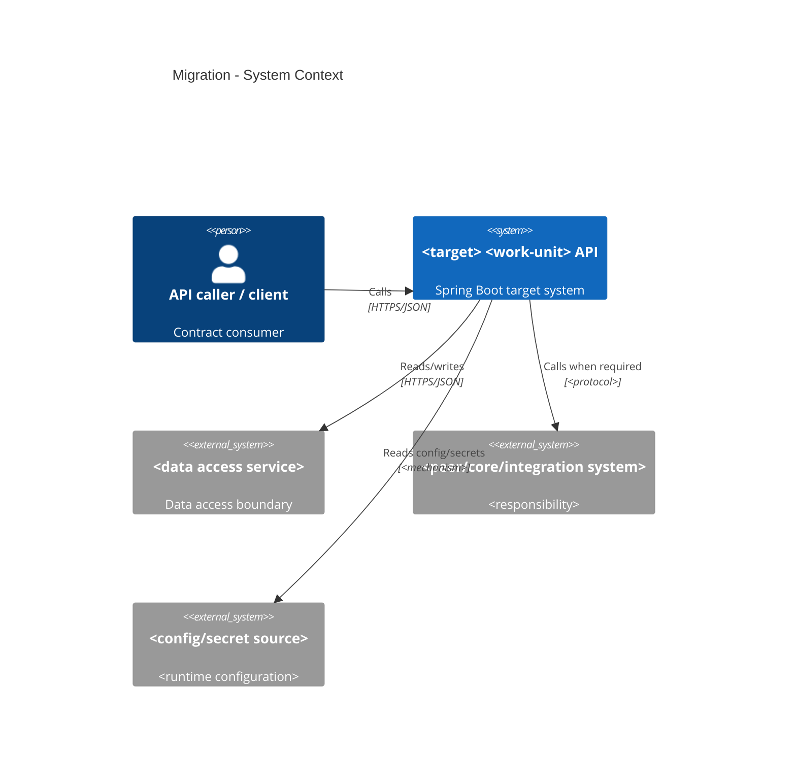
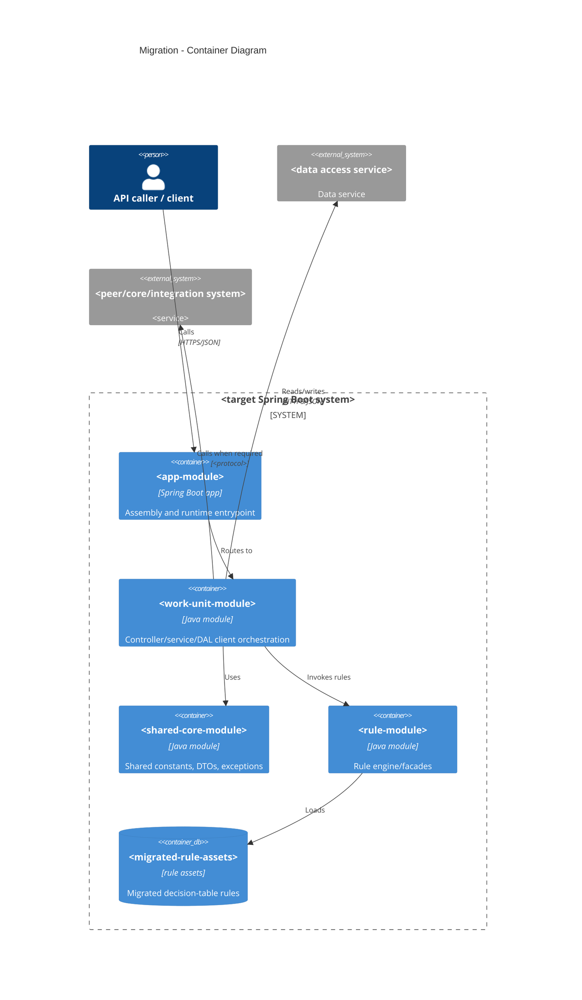
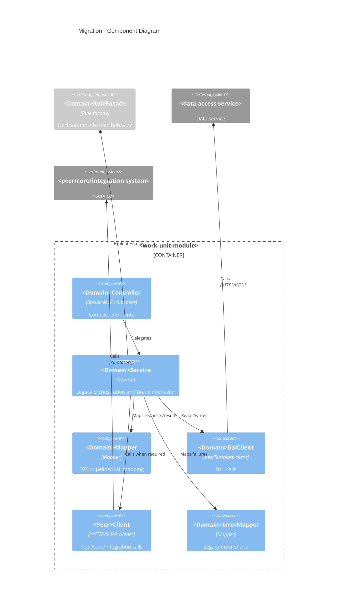

# <Domain Name> Migration Architecture

Status: design phase artifact for human review. Complete this only after the characterization is
approved and its open questions are resolved or explicitly accepted as design gaps.

## Inputs And Approval State

- Approved characterization: `.analysis/<domain>/<domain>-characterization.md`
- Characterization approval:
  - Status:
  - Reviewer:
  - Date:
- Open questions carried into design:
  - `<none or list with decision status>`
- Existing / partial target implementation baseline:
  - `<none found / characterized in source artifact / accepted gap>`

## Characterization Intake Map

Use this section before making target decisions. Every major characterization section should either
feed a design section, become a work package/test obligation, or be recorded as a design gap. Do not
drop characterization findings because they are inconvenient or already partially implemented.

| Characterization section / artifact | Key finding consumed | Architecture section consuming it | Output type | Status / Gap |
| --- | --- | --- | --- | --- |
| Executive Review / Review Verdict | `
` | Design Summary / Design Gaps | `<decision/gap>` | `<status>` |
| Existing / Partial Target Implementation Baseline | `<current target code findings>` | Existing Implementation Reuse / Remediation Plan | `<reuse/refactor/replace/defer/unknown + WP>` | `<status>` |
| Functional Scenarios And Edge Cases | `<scenario list>` | Test And Parity Plan / Scenario To Test Traceability | `<test obligation/gap>` | `<status>` |
| Market Behavior Matrix | `<market differences>` | Rules Design / Dependency Behavior / Test Plan | `<decision/test/gap>` | `<status>` |
| Service Signature And `node.ndf` | `<sig_in/sig_out/doc refs>` | Service Signature And `node.ndf` Traceability | `<DTO/service decision>` | `<status>` |
| Pipeline Variable Lineage | `<producer/consumer/order>` | Service Orchestration And Pipeline Mapping | `<service design/test>` | `<status>` |
| MAP-Node Field Renames | `<field mappings>` | DTO And Contract Shape / Traceability | `<mapping/test>` | `<status>` |
| Branch Logic | `<branches/errors>` | Service Orchestration / Error Handling / Test Plan | `<decision/test>` | `<status>` |
| Dependency Behavior Register | `<headers/config/timeouts/retries/failures>` | Dependency Behavior | `<decision/gap>` | `<status>` |
| Downstream Contract Evidence | `<SOAP/REST namespace/localPart/path/schema/request/response/fault>` | Downstream Contract Design / Test Plan | `<decision/test/gap>` | `<status>` |
| Functional Config And Reference Data | `<config keys/sources/consumers/variance/fallbacks>` | Functional Config And Reference Data Design / Test Plan | `<decision/test/gap>` | `<status>` |
| Error Codes And Messages | `<direct/propagated/shared/unused/unknown codes>` | Error Handling / Test And Parity Plan | `<mapper decision/test/gap>` | `<status>` |
| Side Effects And Atomic Write Boundaries | `<writes/order/idempotency>` | Side Effects And Atomic Write Strategy | `<decision/test>` | `<status>` |
| Data Operations | `<DAL/data mappings>` | DAL Calls | `<decision/test>` | `<status>` |
| Rule Corpus / Required Rule Asset Coverage | `<tables/markets/fixtures/assets>` | Rules Design / Rule Asset Gap And Remediation Plan | `<decision/WP/test/gap>` | `<status>` |
| Decision-Table-To-Target Conversion Fidelity Audit | `<asset verdicts>` | Decision-Table-To-Target Conversion Fidelity | `<wire/remediate/block>` | `<status>` |
| Open Questions / Decisions Required | `<Q-* list>` | Open Question Disposition / Design Decisions / Design Gaps | `<D-* or G-*>` | `<status>` |

## Open Question Disposition

Every `Q-*` from characterization must appear here. No orphan questions are allowed. If a question
is unresolved, dependent work packages must be blocked or explicitly marked as relying on a
human-approved design assumption.

| Characterization Question | Disposition | Design Decision / Gap ID | Owner | Required Before | Dependent Work Packages | Notes |
| --- | --- | --- | --- | --- | --- | --- |
| `Q-001` | `<resolved decision / design gap / approved assumption>` | `<D-* / G-*>` | `<owner>` | `<phase/gate>` | `<WP-* or none>` | `<notes>` |

## Design Summary

- Domain:
- Operations:
- Markets:
- Target Spring Boot modules:
- Contract source:
- Rule asset source:
- DAL/API dependencies:
- External dependencies:
- Functional config/reference-data dependencies:
- Design decision summary:

## C4 Architecture Views

Use these diagrams to make the migration boundary reviewable before coding. Keep each diagram
domain-specific, text-based, and consistent with the target project structure, dependency behavior,
config decisions, and work packages below. Prefer Mermaid `C4Context`, `C4Container`, and
`C4Component` syntax. If Mermaid C4 syntax cannot express a required detail, use a standard Mermaid
flowchart and explain the deviation.

### C4 System Context

Show the migrated work-unit API as one system in its ecosystem. Include users/callers, API gateway
or ingress if in scope, target API, DAL/data service, rule service/assets, peer/core systems,
integration/proxy services, config/secret sources, and external parity-test actors when relevant.
Label each relationship with protocol or interaction type and note trust/auth/data boundaries.

Context notes:

- System boundary:
- In-scope external systems:
- Out-of-scope external systems:
- Trust/auth boundaries:
- Data classification or sensitive fields:
- Design gaps:

### C4 Container Diagram

Show deployable/runtime containers and major persisted artifacts. Include the app assembly module,
work-unit module, shared core module, rule module if used, migrated rule assets, DAL service, peer
services, config or secret providers, and test/parity harnesses when they affect the design. Do not show Java classes
here unless they are the only useful way to express a deployable boundary.

Container notes:

- Deployable containers touched:
- Non-deployable modules/assets touched:
- Runtime config/env keys:
- Dependency direction:
- Forbidden container/module dependencies:
- Design gaps:

### C4 Component Diagram

Show components inside the target domain module and directly used shared/rule components. Include
controllers, services, mappers, validators, DAL clients, peer clients, rule facades, error mappers,
configuration properties, and any component responsible for atomic write/idempotency behavior.
Every component shown here must map to a target file/class in the work packages or be marked as an
approved existing component.

Component notes:

- Components to create:
- Components to reuse/refactor/replace:
- Components intentionally omitted:
- Atomic write/idempotency ownership:
- Error mapping ownership:
- Test seams/mocks:
- Design gaps:

## Design Phase Checklist

- [ ] Characterization is approved and unresolved questions are listed as design gaps or blockers.
- [ ] Characterization Intake Map proves each major characterization section was consumed.
- [ ] Every characterization `Q-*` has a disposition as a `D-*` decision, `G-*` gap/blocker, or
      explicit human-approved design assumption.
- [ ] Existing or partial target implementation from the characterization is classified as
      `reuse`, `refactor`, `replace`, `defer`, or `unknown`.
- [ ] No existing implementation item remains orphaned or implicitly accepted because it already
      exists.
- [ ] C4 System Context, Container, and Component diagrams are present and aligned with the target
      project structure, dependency behavior, config/reference-data decisions, and work packages.
- [ ] Target project structure is locked before coding starts.
- [ ] Contract endpoints, headers, params, DTO fields, response codes, and null/empty behavior are
      mapped exactly.
- [ ] `node.ndf` service signatures and canonical doc types are traced into DTO/service decisions.
- [ ] Pipeline lineage, MAP-node field mappings, branches, loops, and error paths are carried into
      service orchestration.
- [ ] The complete characterized error-code inventory is consumed, including direct domain codes,
      dependency-propagated codes, shared/common translation-table codes, relevant unused codes, and
      unknown-reachability codes.
- [ ] Dependency behavior covers config keys, header/auth propagation, timeout/retry decisions,
      failure mapping, and readiness gaps.
- [ ] SOAP/REST downstream contracts are explicit: runtime endpoint config, protocol, namespace /
      localPart or method/path, schemaVersion/action, request/response/fault mappings, and client
      contract tests.
- [ ] Functional config/reference-data lookups have target source decisions, ownership,
      secret-safety handling, env/tenant/market variance, defaults/fallbacks, and test obligations.
- [ ] Side effects, atomic write boundary, rollback/compensation, idempotency, and partial failures
      are translated into target behavior.
- [ ] Rule assets, model classes, market routing, fixture coverage, and decision-table-to-target
      conversion-fidelity verdicts are explicit.
- [ ] When fixtures/source tables exist but acceptable rule assets do not, remediation work
      packages are created before any dependent functional story.
- [ ] Every characterized happy path, edge case, negative case, dependency-failure case,
      side-effect case, and market-isolation case maps to a test obligation or design gap.
- [ ] Work packages are ordered, dependency-aware, and coding-agent ready.
- [ ] Each work package includes implementation files, tests, gates, acceptance criteria, and known
      gaps.
- [ ] The test and parity plan maps characterization scenarios to unit, contract, rules parity, API
      parity, and edge/negative tests.

## Target Project Structure

Declare module/package ownership before coding. Coding agents implement this approved structure;
they do not infer boundaries during migration.

| Module | Purpose In This Domain | Packages / Classes To Create Or Modify | Dependency Direction | Notes |
| --- | --- | --- | --- | --- |
| `<app module from migration conventions>` | `<assembly only>` | `<configuration only, if any>` | `<app -> domain>` | `<notes>` |
| `<core/shared module from migration conventions>` | `<shared constants/DTOs/exceptions only>` | `<classes>` | `<domain -> core>` | `<notes>` |
| `<domain module from migration conventions>` | `<controller/service/DAL/dto ownership>` | `<classes>` | `<domain -> core/rule>` | `<notes>` |
| `<rule engine module from migration conventions>` | `<rule engine/facade/facts>` | `<classes/resources>` | `<rule -> core/rules assets>` | `<notes>` |
| `<migrated rules directory from migration conventions>` | `<migrated market rule assets>` | `<rule/model assets>` | `<consumed by rule module>` | `<review/staging folders are not target structure unless approved here>` |

Forbidden dependencies:

- `<forbidden direction or direct access>`

DTO ownership and shared-core additions:

- `<decision>`

Rule-asset location and market routing:

- `<decision>`

## Existing Implementation Reuse / Remediation Plan

Use this section when the characterization found current Spring Boot code, DTOs, DAL clients, tests,
rule assets, or other partial target implementation for the domain. Existing target code is not
automatically approved. Design must explicitly decide whether to reuse, refactor, replace, defer, or
block on each item before coding starts.

If no existing target implementation exists, state the checked paths and mark this section
`not-found`.

| Existing target file / asset | Characterization finding | Decision | Required remediation | Work Package | Gap / Blocker |
| --- | --- | --- | --- | --- | --- |
| `<path>` | `<what it currently does / mismatch>` | `<reuse/refactor/replace/defer/unknown>` | `<change or none>` | `<WP-id>` | `<none/gap>` |

Baseline implementation rules:

- Reused files must still meet contract, legacy behavior, dependency, rule, and parity obligations.
- Refactored files need explicit acceptance criteria and tests.
- Replaced files require a migration/removal story so stale behavior is not left reachable.
- `unknown` items block coding work packages that depend on them.

## Contract Endpoints

| Operation | Method | Path | Controller Method | Request Inputs | Response DTO | Notes |
| --- | --- | --- | --- | --- | --- | --- |
| `<operation>` | `<method>` | `<path>` | `<class.method>` | `<headers/params/body>` | `<dto>` | `<notes>` |

## Service Signature And `node.ndf` Traceability

| Operation / Doc Type | `node.ndf` Path | `sig_in` Fields | `sig_out` Fields / `rec_ref` | Required / Optional / Null Semantics | Target DTO / Method Impact | Gap / Decision |
| --- | --- | --- | --- | --- | --- | --- |
| `<operation/doc>` | `<path>` | `<fields>` | `<fields>` | `<semantics>` | `<impact>` | `<gap/decision>` |

## DTO And Contract Shape

| DTO | Field | Type | Required | Source | Mapping / Default | Notes |
| --- | --- | --- | --- | --- | --- | --- |
| `<dto>` | `<field>` | `<type>` | `<yes/no>` | `<contract/node.ndf/pipeline>` | `<mapping>` | `<notes>` |

## Characterization To Design To Code/Test Traceability

Every meaningful characterization finding should have a design decision and a later code/test
obligation. Use this table to prevent behavior from being lost between phases.

| Characterization Evidence | Design Decision | Target File / Class | Test Obligation | Gap / Blocker |
| --- | --- | --- | --- | --- |
| `<source finding>` | `<target decision>` | `<file/class>` | `<unit/contract/rules/API parity>` | `<none or gap>` |
| `<existing implementation finding>` | `<reuse/refactor/replace/defer>` | `<existing/new file>` | `<regression/parity test>` | `<none or gap>` |

## Service Orchestration And Pipeline Mapping

| Step | Source Legacy Service | Target Class / Method | Inputs | Outputs | Field / Pipeline Notes |
| --- | --- | --- | --- | --- | --- |
| `<n>` | `<legacy service>` | `<class.method>` | `<inputs>` | `<outputs>` | `<lineage/rename/branch>` |

## Dependency Behavior

| Dependency | Legacy Source | Target Replacement | Config Key | Headers / Auth | Timeout / Retry | Failure Mapping | Readiness |
| --- | --- | --- | --- | --- | --- | --- | --- |
| `<dependency>` | `<source>` | `<target>` | `<env/config>` | `<headers>` | `<decision>` | `<mapping>` | `<ready/gap>` |

## Downstream Contract Design

For each SOAP/REST peer dependency, decide the exact target client contract. Keep endpoint URL/env
configuration separate from protocol/schema constants. Any unknown namespace, root element,
schemaVersion, method/path, request field, response field, or fault mapping is a design gap until
resolved or explicitly accepted.

| Dependency | Target Client | Protocol | Endpoint Config | Contract Evidence | Operation / Method | Namespace / localPart / Path | Schema Version / Action | Request Mapping | Response Mapping | Fault/Error Mapping | Tests | Decision / Gap |
| --- | --- | --- | --- | --- | --- | --- | --- | --- | --- | --- | --- | --- |
| `<dependency>` | `<class>` | `<SOAP/REST/other>` | `<property/env/secret>` | `<WSDL/XSD/source annotation/node.ndf>` | `<SOAP op or HTTP method>` | `<namespace+localPart or REST path>` | `<schemaVersion/SOAPAction/n-a>` | `<DTO/pipeline -> request>` | `<response -> DTO/pipeline>` | `<fault/status -> error>` | `<unit/client contract/API parity>` | `<D-* or G-*>` |

## Functional Config And Reference Data Design

For every behavior-affecting config/reference lookup from characterization, specify where the
target implementation obtains the value and how tests prove parity. Do not promote legacy runtime
config values into constants unless this design explicitly approves them as static reference data.
Do not copy secrets or sensitive values into this artifact.

| Legacy lookup / key | Behavior impact | Legacy source evidence | Target source / owner | Target property / endpoint / fixture | Secret handling | Env / tenant / market variance | Default / fallback / missing behavior | Tests / gates | Decision / Gap |
| --- | --- | --- | --- | --- | --- | --- | --- | --- | --- |
| `<service + key>` | `<branch/endpoint/rule/error/response effect>` | `<flow/config source>` | `<Spring config/secret/DAL/app config/static approved/gap>` | `<property/endpoint/path>` | `<none/secret store/omitted>` | `<variance>` | `<behavior>` | `<unit/API parity/etc.>` | `<D-* or G-*>` |

Target config implementation notes:

- Configuration properties/classes:
- Validation behavior:
- Refresh/caching assumptions:
- Values intentionally not migrated:
- Human decisions needed:

## Deployment / Helm / Runtime Impact

State how the target implementation must run locally and deploy. If a row has no impact, say
`no-change` with evidence; do not leave it blank for the coding agent to infer.

| Area | Current Target State | Required Change | Target Files / Chart Values | Secret Handling | Health / Probe Impact | Decision / Gap |
| --- | --- | --- | --- | --- | --- | --- |
| Local runtime stack | `<compose/services>` | `<start/build/env>` | `<compose file/script/runtime selection>` | `<none/secret>` | `<health URL>` | `<D-* or G-*>` |
| API Helm chart | `<chart path>` | `<env/ports/probes/resources>` | `<values/templates/env files>` | `<none/secret-placeholder>` | `<liveness/readiness>` | `<D-* or G-*>` |
| Support-service Helm chart | `<chart path or n/a>` | `<env/ports/probes/resources>` | `<values/templates/env files>` | `<none/secret-placeholder>` | `<liveness/readiness>` | `<D-* or G-*>` |

Runtime notes:

- Local health gate command expectation:
- Actuator health endpoint and management exposure:
- New/changed environment variables:
- New/changed secret placeholders:
- Ingress/service exposure impact:
- Deploy-owner gaps:

## DAL Calls

| Use Case | DAL Endpoint | Method | Request Mapping | Response Mapping | Atomic Write Boundary | Notes |
| --- | --- | --- | --- | --- | --- | --- |
| `<use case>` | `<path>` | `<method>` | `<mapping>` | `<mapping>` | `<boundary>` | `<notes>` |

## Rules Design

| Rule Table | Market | Source Decision Table | Rule Asset | Model Class | Result Class | Inputs | Outputs | Gap / Decision |
| --- | --- | --- | --- | --- | --- | --- | --- | --- |
| `<table>` | `<market>` | `<legacy .decisiontable path>` | `<path>` | `<class>` | `<class>` | `<inputs>` | `<outputs>` | `<gap/decision>` |

## Decision-Table-To-Target Conversion Fidelity

Design may wire only audited rule assets reconciled to legacy `.decisiontable` source. Existing
rule assets under repository `rules/` are candidate migrated implementation and must also pass
implementation-shape verification: compile/load or build success, module/package routing, model
compatibility, fixture/test reconciliation, and market isolation. Stale/non-authoritative
evidence is not acceptable unless a human explicitly approved a named exception. Add remediation
work packages before any story that wires an affected rule.

| Rule Table | Market | Characterization Verdict | Source Decision Table / Implementation / Test Reconciliation | Implementation-Shape Verification | Helper / Operator Translation | Conflict / Overwrite Risk | Design Decision | Required Work Package |
| --- | --- | --- | --- | --- | --- | --- | --- | --- |
| `<table>` | `<market>` | `<pass/blocker>` | `<counts/evidence>` | `<compile/load, module/package, market isolation>` | `<status>` | `<status>` | `<wire/remediate/gap>` | `<WP-id>` |

## Rule Asset Gap And Remediation Plan

Use this section whenever characterization found source `.decisiontable` files and fixtures but no
acceptable target rule asset. Rule-dependent functional stories must depend on these
remediation work packages rather than silently bypassing rule parity.

| Gap | Affected Tables / Markets | Required Remediation | Target Files / Assets | Acceptance Evidence | Work Package | Blocks |
| --- | --- | --- | --- | --- | --- | --- |
| `<missing rule impl/model/routing/tests>` | `<tables/markets>` | `<generate/author/reconcile/wire>` | `<paths/classes>` | `<compile/load, fixture reconciliation, rules parity, market isolation>` | `<WP-id>` | `<WP-id or function>` |

## Side Effects And Atomic Write Strategy

| Operation | Side Effect | Order | Boundary | Rollback / Compensation | Idempotency Guard | Partial Failure Behavior |
| --- | --- | --- | --- | --- | --- | --- |
| `<operation>` | `<effect>` | `<order>` | `<boundary>` | `<behavior>` | `<guard>` | `<behavior>` |

## Error Handling

The design must consume the full characterized error inventory. Do not implement only the directly
hardcoded domain codes when characterization also found dependency-propagated or shared/common
translation-table codes. Codes that are not reachable must still be explicitly classified so the
coding and test agents know they are intentionally excluded or blocked.

| Code | Usage classification | Condition / producer | Legacy Error / Message | Target HTTP Status | Target Error Body | Source | Design decision | Test obligation / Gap |
| --- | --- | --- | --- | --- | --- | --- | --- | --- |
| `<code>` | `<domain-direct/dependency-propagated/shared-translation/domain-service-unused/shared-unused/unknown-reachability>` | `<condition or dynamic source field>` | `<legacy>` | `<status>` | `<body>` | `<source>` | `<map/exclude/block>` | `<test or G-*>` |

## Implementation Order

1. `<first low-risk enabling step>`
2. `<next step>`
3. `<next step>`

## Coding Stories / Work Packages

Break the design into coding-agent-ready slices. Each work package must be independently
implementable and must not depend on unresolved design gaps.

| ID | Story / Work Package | Scope | Target Files / Classes | Depends On | Acceptance Criteria | Tests / Gates | Open Gaps |
| --- | --- | --- | --- | --- | --- | --- | --- |
| `WP-001` | `<story>` | `<scope>` | `<files/classes>` | `<deps>` | `<criteria>` | `<tests/gates>` | `<none/gap>` |

### Work Package Definition Of Done

Each `WP-*` is done only when:

- [ ] Approved target files/classes are implemented or the design is updated.
- [ ] Contract shape remains exact.
- [ ] Legacy `node.ndf`, pipeline, branch, dependency, side-effect, and error decisions in scope are
      represented in code.
- [ ] SOAP/REST downstream clients preserve approved namespace/localPart or method/path,
      schemaVersion/action, request/response fields, fault mapping, endpoint config, and tests.
- [ ] Functional config/reference-data decisions in scope are implemented through the approved
      target source, with no hardcoded legacy runtime values unless explicitly approved.
- [ ] Deployment/runtime decisions in scope are implemented or recorded as approved gaps: Helm
      chart/value files, secret placeholders, service ports, actuator health paths, probes, and
      downstream URLs.
- [ ] Direct, propagated, shared/common, unused, and unknown-reachability error-code classifications
      in scope are either implemented, tested, explicitly excluded by approved design, or captured
      as gaps.
- [ ] Rule assets wired by the work package have passing decision-table-to-target conversion-fidelity
      evidence, implementation-shape verification, and market isolation.
- [ ] Unit tests cover mapping, branch, dependency-failure, and edge behavior in scope.
- [ ] Contract/rules/API parity fixtures or tests affected by the work package are updated.
- [ ] `.analysis/<domain>/<domain>-migration-progress.md` maps the work package to status,
      implemented files, tests, gaps, blockers, and review notes.

## Test And Parity Plan

| Test Type | Scope | Fixtures / Data | Command / Gate | Acceptance Criteria |
| --- | --- | --- | --- | --- |
| Unit | `<scope>` | `<data>` | `domain_migration_checks_green` | `<criteria>` |
| Contract | `<scope>` | `<contract>` | `contract_verified` | `<criteria>` |
| Rules parity | `<scope>` | `tests/parity-data/rules/...` | `rules_parity_verified` | `<criteria>` |
| Cross-domain regression | `<scope>` | `<baseline waiver evidence or none>` | `cross_domain_regression_green` | `<criteria>` |
| Local Spring Boot health | `<local runtime stack + API health>` | `<compose/services/env>` | `springboot_app_health_checked` | `<criteria>` |
| API parity | `<scope>` | `tests/parity-data/api/<domain>/...` | `api_parity_verified` | `<criteria>` |
| Edge / negative | `<scope>` | `<fixtures>` | `<gate>` | `<criteria>` |

## Scenario To Test Traceability

Every scenario from characterization must appear here or be recorded as a design gap. Include happy
paths, edge cases, negative cases, dependency failures, side effects, and market-isolation cases.

| Characterized Scenario | Source Evidence | Test Type | Fixture / Data | Target Test / Gate | Work Package | Gap / Blocker |
| --- | --- | --- | --- | --- | --- | --- |
| `<scenario>` | `<characterization section/source>` | `<unit/contract/rules parity/API parity/edge>` | `<fixture>` | `<test/gate>` | `<WP-id>` | `<none or G-*>` |

## Design Decisions

| ID | Decision | Rationale | Alternatives Considered | Owner | Status |
| --- | --- | --- | --- | --- | --- |
| `D-001` | `<decision>` | `<rationale>` | `<alternatives>` | `<owner>` | `<pending/approved>` |

## Design Gaps And Blockers

| ID | Gap | Impact | Options | Recommendation | Owner | Required Before |
| --- | --- | --- | --- | --- | --- | --- |
| `G-001` | `<gap>` | `<impact>` | `<options>` | `<recommendation>` | `<owner>` | `<design/migrate/gate>` |

## Human Review Checklist

- [ ] Characterization open questions are resolved or explicitly accepted as design gaps.
- [ ] No characterization question is orphaned; every `Q-*` appears in Open Question Disposition.
- [ ] Characterization Intake Map is complete enough to show no major source section was skipped.
- [ ] C4 System Context, Container, and Component diagrams make system boundaries, container/module
      ownership, component responsibilities, trust/auth boundaries, and external dependencies clear.
- [ ] Target project structure is clear enough for a coding agent to implement without guessing.
- [ ] Deployment/runtime impact is explicit: Helm chart updates, env/secret placeholders, service
      ports, actuator health/probes, and local health-check expectations are stated or marked
      no-impact.
- [ ] Existing implementation has explicit reuse/refactor/replace/defer decisions and remediation
      work packages.
- [ ] No existing implementation item is implicitly trusted without gap review.
- [ ] `node.ndf` service signatures and canonical doc types are traced into DTO/service decisions.
- [ ] Contract endpoints and DTO shape match the target API specification declared in migration
      conventions.
- [ ] Pipeline lineage and MAP-node field mappings are carried into the service design.
- [ ] Dependency behavior covers config, headers/auth, timeout/retry, and failure mapping.
- [ ] Downstream SOAP/REST contract details are proven from WSDL/XSD/source evidence and mapped to
      implementation and tests.
- [ ] Functional config/reference data has explicit target source decisions and tests; secrets are
      not copied into code, docs, fixtures, or logs.
- [ ] Error handling covers the full characterized inventory, not only directly thrown domain codes.
- [ ] Side effects and atomic write boundaries are explicit.
- [ ] Rule assets, model classes, market gaps, and decision-table-to-target conversion-fidelity
      verdicts are explicit.
- [ ] Existing `rules/` assets have implementation-shape verification before any work package
      wires them.
- [ ] No work package wires a rule asset with unresolved conversion-loss or implementation-shape
      blockers.
- [ ] Missing rule assets have remediation work packages before dependent functional stories.
- [ ] Every characterized scenario maps to a test obligation or an explicit design gap.
- [ ] Coding stories / work packages are sequenced and ready for the coding agent.
- [ ] Test plan covers unit, contract, rules parity, API parity, and edge cases.
- [ ] Design is approved for migrate phase.
