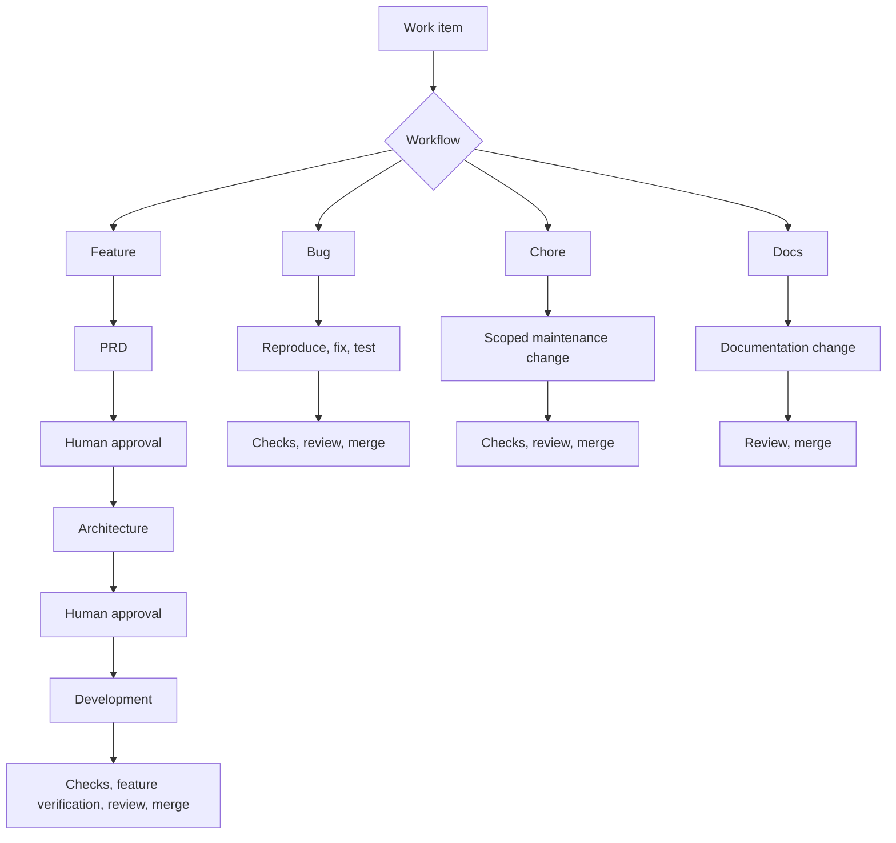
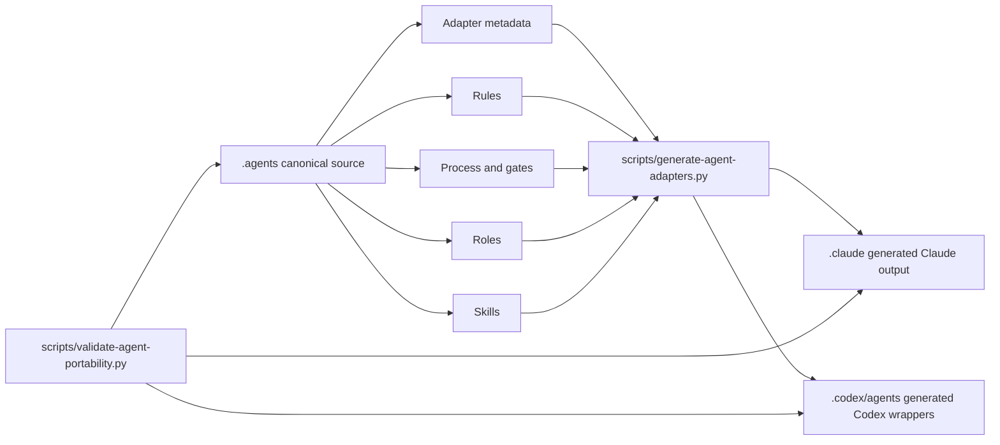

# Portable Agentic Coding Harness

## Introduction

Portable Agentic Coding Harness is a lightweight agentic coding workflow for repositories that want
repeatable coding lifecycles without locking the project to one LLM host. It gives teams a small,
portable structure for phases, gates, roles, reusable skills, and project conventions, then exposes
that same structure to both Codex and Claude Code.

The core rule is:

```text
Edit .agents/ -> generate .claude/ and .codex/agents/ -> validate
```

`.agents/` is the canonical source. `.claude/` and `.codex/agents/` are generated host adapters.

## First-Time Reader Path

- If you are evaluating this for a team, read `Introduction`, `Workflow Overview`,
  `Supported Workflows`, and `What This Repo Is Not`.
- If you are onboarding a Python/FastAPI repository today, follow the
  [Python/FastAPI onboarding example](package/docs/agentic-workflow/onboarding/python-fastapi.md).
- If you are onboarding another stack, start from
  `package/.agents/rules/project-conventions-template.md`, then use the workflow docs to decide which
  skills and gates apply.
- If you are running actual work, choose the matching workflow process file and use the role named
  by that phase or gate.
- If you are maintaining this package, see `CLAUDE.md`/`AGENTS.md` and `MAINTAINER-CONVENTIONS.md` at
  this repo's root.

## How To Use This

1. From the target repository's root, run the installer for your platform:

   macOS/Linux:

   ```bash
   curl -fsSL https://raw.githubusercontent.com/nkumar15/agentic-coding-harness/main/scripts/install.sh | sh
   ```

   Windows (PowerShell):

   ```powershell
   irm https://raw.githubusercontent.com/nkumar15/agentic-coding-harness/main/scripts/install.ps1 | iex
   ```

   Windows (classic `cmd.exe`):

   ```bat
   curl -fsSL https://raw.githubusercontent.com/nkumar15/agentic-coding-harness/main/scripts/install.bat -o install.bat && install.bat
   ```

   The installer copies `package/`'s contents into your repo's root, prompts for initial
   configuration, and runs the adapter generator and portability validator. Re-running it later
   updates the generic package files without touching an already-filled
   `project-conventions.md` or a customized `gates.yaml`. See the
   [installation-process PRD](package/docs/agentic-workflow/prd/002-installation-process.md) for
   the full design, and pass `--addon <name>` (or `-Addon <name>` on Windows) to layer an optional
   add-on package such as `migration-workflow`.
2. Fill `.agents/rules/project-conventions.md` from
   `.agents/rules/project-conventions-template.md`. For a Python stack, follow the
   [Python/FastAPI onboarding example](package/docs/agentic-workflow/onboarding/python-fastapi.md).
3. Replace placeholder gate commands in `.agents/process/gates.yaml` with commands backed by the
   convention files. See the [gate command example](package/docs/agentic-workflow/README.md#gate-command-example).
5. Choose the process provider in `.agents/process/config.yaml`, usually `local` first and `github`
   when tracker/change-request automation is ready.
6. Regenerate host adapters:

   ```bash
   python3 scripts/generate-agent-adapters.py
   python3 scripts/validate-agent-portability.py
   ```

7. Commit `.agents/`, `.claude/`, `.codex/agents/`, `AGENTS.md`, `CLAUDE.md`, `scripts/`, docs,
   and CI.
8. Restart Codex or Claude Code if newly generated agents are not discovered immediately.
9. Start work through the declared process in `.agents/process/<workflow>.yaml`, using the matching
   role from `.codex/agents/` or `.claude/agents/`.

## Why Conventions Matter

The convention files are the contract between your repository and the agents. Make them detailed.
Models work best when they can resolve paths, commands, stack choices, artifact locations, runtime
requirements, test commands, deployment boundaries, naming rules, and hard constraints without
guessing.

Put project-specific facts here:

- `.agents/rules/project-conventions.md` for application stack, source layout, PRD/architecture
  locations, verification commands, runtime commands, and stack-skill selection.

Do not duplicate those facts in roles, skills, generated host files, or ad hoc prompts. If a model
has to infer a command, path, API contract, module boundary, or environment name, the convention
file is not detailed enough.

## Workflow Overview



## Supported Workflows

| Workflow | Use when | Process file | Shape | Detailed docs |
|---|---|---|---|---|
| Feature | New behavior needs requirements and architecture before coding. | `.agents/process/feature.yaml` | PRD -> architecture -> development -> gates | [Feature workflow](package/docs/agentic-workflow/feature/README.md) |
| Bug | Existing behavior is wrong and needs a scoped fix plus regression evidence. | `.agents/process/bug.yaml` | reproduce -> fix -> test -> gates | [Bug workflow](package/docs/agentic-workflow/bug/README.md) |
| Chore | Maintenance work does not need product requirements or architecture. | `.agents/process/chore.yaml` | scoped maintenance -> gates | [Chore workflow](package/docs/agentic-workflow/chore/README.md) |
| Docs | The change is documentation-only. | `.agents/process/docs.yaml` | documentation change -> review -> merge | [Docs workflow](package/docs/agentic-workflow/docs/README.md) |

All workflows are declarative. Process files name phases, roles, branches, artifacts, and gates.
Gate definitions live in `.agents/process/gates.yaml`.

Each workflow guide explains the supported use case in detail: workflow diagram, roles, models,
skills, phase behavior, gates, failure routing, required convention detail, design rationale, and
done criteria.

## Onboarding Examples

| Stack | Guide | Covers |
|---|---|---|
| Python/FastAPI | [Python/FastAPI onboarding](package/docs/agentic-workflow/onboarding/python-fastapi.md) | Filling project conventions, selecting `python-fastapi` and `pytest`, replacing gate commands, validating adapters, and starting feature/bug/chore/docs workflows. |

## Related Comparisons

| Topic | Guide |
|---|---|
| BMAD Method comparison | [How this differs from BMAD](package/docs/agentic-workflow/bmad-comparison.md) |

## Supported Skills

Skills are reusable capability packages under `.agents/skills/`. They are not all used for every
repository. Feature agents select stack skills from `.agents/rules/project-conventions.md`. Skill
source files live under `.agents/skills/<skill>/SKILL.md`.

| Area | Skills | Used for |
|---|---|---|
| Workflow orchestration | `orchestrate` | Drive tracked work through process phases, gates, providers, and role routing. |
| Requirements and design | `prd`, `feature-architecture` | Produce feature PRDs and coding-ready feature architecture. |
| Application implementation and verification | `application-implementation`, `application-verification` | Implement scoped application changes and evaluate verification gates. |
| Backend stacks | `python-fastapi`, `java-springboot` | Python/FastAPI backend work and Java/Spring Boot backend work. |
| Frontend stack | `react-ui` | React UI changes using project-declared component, routing, state, and styling conventions. |
| Data | `postgres-migrations` | PostgreSQL schema/data migrations. |
| Test stacks | `pytest`, `junit` | Python tests and Java JUnit tests. |

## Supported External Integrations

| Integration | Built-in support | Where it is configured |
|---|---|---|
| Codex | Generated custom-agent wrappers under `.codex/agents/`; `AGENTS.md` is the Codex entrypoint. | `.agents/adapters/codex/*.yaml`, generated by `scripts/generate-agent-adapters.py` |
| Claude Code | Generated agents, rules, process files, and skills under `.claude/`; `CLAUDE.md` is the Claude entrypoint. | `.agents/adapters/claude/*.yaml`, generated by `scripts/generate-agent-adapters.py` |
| Local/manual workflow mode | No external tracker or pull request system; approval gates become explicit human confirmations. | `.agents/process/config.yaml` with `provider: local`, backed by `.agents/process/provider.local.yaml` |
| GitHub Issues and Pull Requests | Work items map to GitHub Issues and change requests map to GitHub PRs through the `gh` CLI. | `.agents/process/config.yaml` with `provider: github`, backed by `.agents/process/provider.github.yaml` |
| GitHub Actions | Portability validation runs in CI. | `.github/workflows/agent-portability.yml` |
| Jira | Planned future tracker integration; not implemented in this package yet. | A future `.agents/process/provider.jira.yaml` can be selected from `.agents/process/config.yaml` |

Provider integrations are intentionally isolated. To add Azure DevOps or another tracker, add a
provider file such as `.agents/process/provider.azure-devops.yaml` and select it in
`.agents/process/config.yaml`; the workflow process files and roles should not change.

## Source And Adapter Flow



## What This Repo Is Not

- It assists coding, verification, and review workflows; human engineering judgment, testing
  standards, code review decisions, and approval gates remain authoritative.
- It is not a project-specific prompt dump. Project facts belong in convention files.
- It is not a secret store, deployment system, ticketing system, or CI platform.
- It is not tied to one application stack. Stack behavior is selected by conventions and touched
  files.
- It is not proof that generated code is correct. Gates and reviewers still need real commands,
  artifacts, evidence, and human approval.
- It is not the place to copy Claude memory or local settings from another repository.

## Directory Layout

Paths below are relative to the installed package root. In this source repo, that root is
`package/`; once installed into a consuming repository, `package/`'s contents become that
repository's own root.

| Path | Purpose |
|---|---|
| `.agents/rules/` | Canonical behavior, SCM, command, project, and verification rules. |
| `.agents/process/` | Workflow process specs, gate definitions, provider adapters, and config. |
| `.agents/roles/` | Host-neutral role definitions. |
| `.agents/skills/` | Reusable skill packages. |
| `.agents/adapters/claude/` | Claude Code model/tool/frontmatter metadata. |
| `.agents/adapters/codex/` | Codex custom-agent metadata. |
| `.claude/` | Generated Claude-compatible agents, rules, process files, and skills. |
| `.codex/agents/` | Generated Codex custom-agent wrappers. |
| `docs/agentic-workflow/` | Workflow design, rationale, and adoption documentation. |
| `scripts/` | Adapter generator and portability validator. |

This source repo additionally has, at its own root (not part of the installed package):
`package/` (the directory holding everything above), `CLAUDE.md`/`AGENTS.md` (this repo's own
maintainer entrypoints), and `MAINTAINER-CONVENTIONS.md` (this repo's filled project facts).

## Maintenance Rules

Maintaining this package (the source repo itself) is a different concern from adopting it; see
`CLAUDE.md`, `AGENTS.md`, and `MAINTAINER-CONVENTIONS.md` at this repo's root for the full picture.
In short:

- Edit `package/.agents/` first.
- Do not hand-edit generated `package/.claude/` or `package/.codex/agents/` files.
- Keep roles and skills generic. They should refer to convention sections for project facts.
- Keep generated files committed so a fresh clone works for both host tools.
- After workflow-source or adapter changes, run:

  ```bash
  python3 package/scripts/generate-agent-adapters.py
  python3 package/scripts/validate-agent-portability.py
  ```

The GitHub Actions workflow at `.github/workflows/agent-portability.yml` runs the same portability
checks against `package/`.
