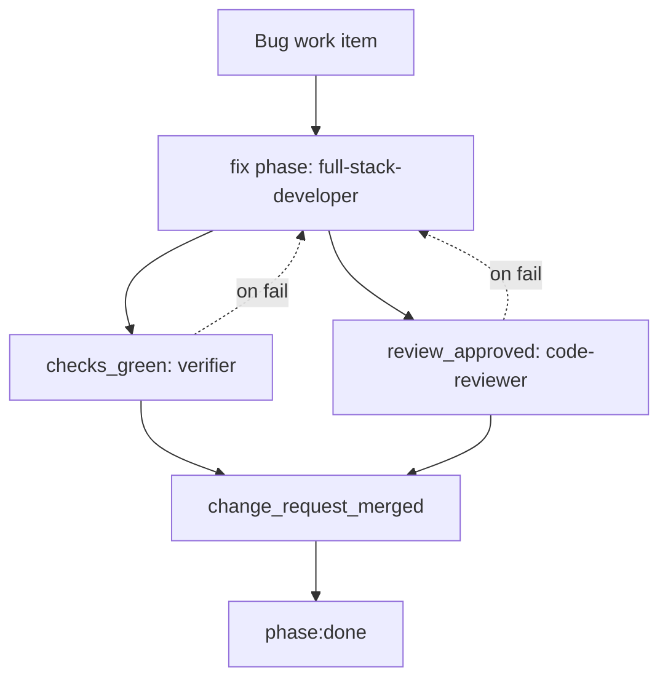

# Bug Workflow

The bug workflow is for correcting existing behavior. It is intentionally shorter than feature
development: one scoped change request should reproduce or characterize the defect, fix it, and
prove the fix.

Process file: `.agents/process/bug.yaml`

## Workflow Diagram

## Roles And Models

| Order | Step | Phase or gate | Role | Codex model | Claude model | Skills |
|---:|---|---|---|---|---|---|
| 1 | Reproduce, fix, test | `fix` phase | `full-stack-developer` | `gpt-5-codex`, high | `sonnet` | `application-implementation`, optional stack skills |
| 2 | Run checks | `checks_green` | `verifier` | `gpt-5-codex`, low | `haiku` | `application-verification`, optional test skills |
| 3 | Review fix | `review_approved` | `code-reviewer` | `gpt-5-codex`, high | `sonnet` | `application-verification`, optional stack skills |
| 4 | Merge final change | `change_request_merged` | Human | n/a | n/a | n/a |

## Phase Details

The `full-stack-developer` owns the single `fix` phase. It should reproduce the defect or add a
focused regression test before fixing when feasible. If reproduction requires unavailable data,
credentials, or services, the agent should document the blocker and make the safest local
characterization it can support.

The output is the fix, the regression or targeted test, and verification evidence.

## Gate Details

| Gate | Owner | Purpose | Failure route |
|---|---|---|---|
| `checks_green` | `verifier` | Run global verification commands from project conventions. | `full-stack-developer` |
| `review_approved` | `code-reviewer` | Confirm the fix is scoped, correct, secure, convention-compliant, and tested. | `full-stack-developer` |
| `change_request_merged` | Human/provider | Confirm final approval and merge. | Manual |

## Required Convention Detail

Bug work depends on the same project convention detail as feature work, with extra emphasis on:

- exact commands for focused and global tests
- log/runtime commands useful for reproduction
- fixture locations and safe sample data
- ownership boundaries for generated files and external integrations
- known flaky tests or approved waivers, if any

## Design Rationale

Bug fixes skip PRD and architecture phases because the expected behavior usually already exists in
the product, tests, contract, or incident report. The workflow still requires tests, checks, review,
and merge approval so small fixes do not bypass quality gates.

## Done Criteria

A bug is done when the change request is merged after `checks_green` and `review_approved` pass.
