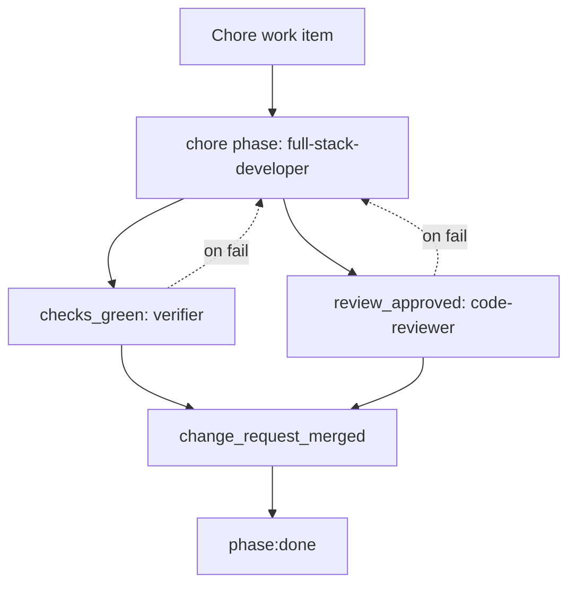

# Chore Workflow

The chore workflow is for technical debt, dependency updates, tooling changes, infrastructure
maintenance, and other scoped work that does not need PRD or architecture phases.

Process file: `.agents/process/chore.yaml`

## Workflow Diagram

## Roles And Models

| Order | Step | Phase or gate | Role | Codex model | Claude model | Skills |
|---:|---|---|---|---|---|---|
| 1 | Implement scoped maintenance | `chore` phase | `full-stack-developer` | `gpt-5-codex`, high | `sonnet` | `application-implementation`, optional stack skills |
| 2 | Run checks | `checks_green` | `verifier` | `gpt-5-codex`, low | `haiku` | `application-verification`, optional test skills |
| 3 | Review change | `review_approved` | `code-reviewer` | `gpt-5-codex`, high | `sonnet` | `application-verification`, optional stack skills |
| 4 | Merge final change | `change_request_merged` | Human | n/a | n/a | n/a |

## Phase Details

The `full-stack-developer` owns the single `chore` phase. It may edit source, tests, docs, build
configuration, tooling, or infrastructure files required by the chore. It must keep the change
limited to the stated maintenance goal and avoid opportunistic refactors.

Examples:

- dependency or plugin updates
- CI, lint, formatting, or build-tool changes
- non-behavioral refactors with explicit scope
- config cleanup
- test harness improvements
- developer-experience scripts

## Gate Details

| Gate | Owner | Purpose | Failure route |
|---|---|---|---|
| `checks_green` | `verifier` | Run the project checks that prove maintenance did not break behavior. | `full-stack-developer` |
| `review_approved` | `code-reviewer` | Confirm the change is scoped, maintainable, secure, and evidenced. | `full-stack-developer` |
| `change_request_merged` | Human/provider | Confirm final approval and merge. | Manual |

## Required Convention Detail

Chore work needs detailed conventions for:

- build, lint, format, test, and packaging commands
- dependency management policy
- generated-file ownership
- CI workflow ownership
- infrastructure and environment boundaries
- allowed versus disallowed refactor scope

## Design Rationale

Chores often look simple but can have broad blast radius. The workflow keeps them lightweight while
still enforcing verification and review. It avoids PRD and architecture overhead, but does not allow
unchecked maintenance changes.

## Done Criteria

A chore is done when the change request is merged after `checks_green` and `review_approved` pass.
