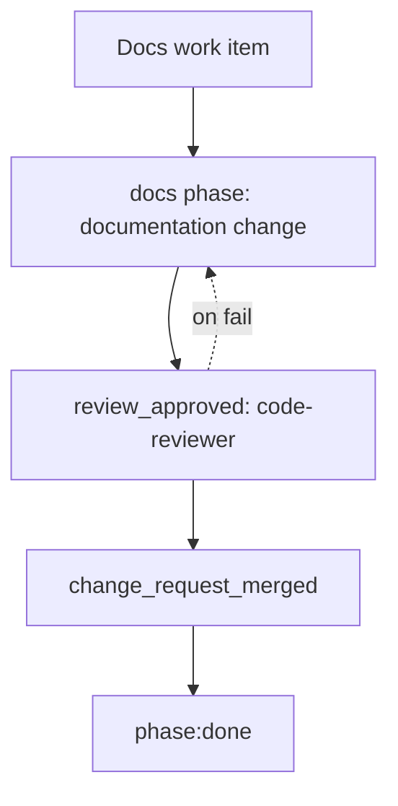

# Docs Workflow

The docs workflow is for documentation-only changes. It is deliberately lightweight: write the
documentation, review it, and merge it.

Process file: `.agents/process/docs.yaml`

## Workflow Diagram

## Roles And Models

| Order | Step | Phase or gate | Role | Codex model | Claude model | Skills |
|---:|---|---|---|---|---|---|
| 1 | Write docs | `docs` phase | Host/default author or human | n/a | n/a | Project conventions |
| 2 | Review docs | `review_approved` | `code-reviewer` | `gpt-5-codex`, high | `sonnet` | `application-verification` when evidence is relevant |
| 3 | Merge docs | `change_request_merged` | Human | n/a | n/a | n/a |

The current process file intentionally does not bind the docs phase to a dedicated agent. A
consuming repository can add a docs-author role if it wants a named documentation agent.

## Phase Details

The `docs` phase changes only documentation. If the work requires source, test, build, deployment,
or behavior changes, route it through feature, bug, chore, or migration instead.

Documentation should follow the project-defined documentation root, naming, ownership, style, and
review requirements.

## Gate Details

| Gate | Owner | Purpose | Failure route |
|---|---|---|---|
| `review_approved` | `code-reviewer` | Confirm docs are accurate, scoped, convention-compliant, and not missing required evidence. | Docs author |
| `change_request_merged` | Human/provider | Confirm final approval and merge. | Manual |

## Required Convention Detail

Docs work needs conventions for:

- documentation root and file naming
- audience and style expectations
- ownership for architecture, runbook, API, migration, and user-facing docs
- generated-doc boundaries
- required evidence when docs claim verification, commands, API behavior, or deployment behavior

## Design Rationale

Documentation-only changes should not require full application checks by default. The workflow keeps
the path short while still requiring review and merge approval. If a docs change depends on code
truth, the reviewer should require evidence or route the change to a workflow with verification
gates.

## Done Criteria

A docs change is done when the documentation change request is reviewed and merged.
