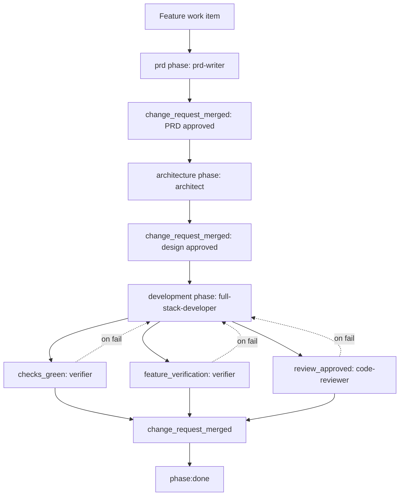

# Feature Workflow

The feature workflow is for new user-facing or system behavior that needs requirements, design,
implementation, verification, review, and human approval.

Process file: `.agents/process/feature.yaml`

## Workflow Diagram

## Roles And Models

| Order | Step | Phase or gate | Role | Codex model | Claude model | Skills |
|---:|---|---|---|---|---|---|
| 1 | Write requirements | `prd` phase | `prd-writer` | `gpt-5-codex`, medium | `sonnet` | `prd` |
| 2 | Approve requirements | `change_request_merged` | Human | n/a | n/a | n/a |
| 3 | Design solution | `architecture` phase | `architect` | `gpt-5-codex`, high | `opus` | `feature-architecture`, optional stack skills |
| 4 | Approve design | `change_request_merged` | Human | n/a | n/a | n/a |
| 5 | Implement | `development` phase | `full-stack-developer` | `gpt-5-codex`, high | `sonnet` | `application-implementation`, optional stack skills |
| 6 | Run checks | `checks_green` | `verifier` | `gpt-5-codex`, low | `haiku` | `application-verification`, optional test skills |
| 7 | Verify feature evidence | `feature_verification` | `verifier` | `gpt-5-codex`, low | `haiku` | `application-verification`, optional test skills |
| 8 | Review implementation | `review_approved` | `code-reviewer` | `gpt-5-codex`, high | `sonnet` | `application-verification`, optional stack skills |
| 9 | Merge final change | `change_request_merged` | Human | n/a | n/a | n/a |

Optional feature stack skills are selected from `.agents/rules/project-conventions.md` and touched
files: `python-fastapi`, `java-springboot`, `react-ui`, `postgres-migrations`, `pytest`, and
`junit`.

## Phase Details

### PRD

The `prd-writer` produces the product requirements artifact in the path declared by project
conventions. It should capture problem, goals, users, user stories, acceptance criteria, non-goals,
dependencies, risks, and verification requirements.

The phase exits only after `change_request_merged`. This forces human approval before technical
design starts.

### Architecture

The `architect` converts the approved PRD into a coding-ready design. It maps requirements to data,
APIs, services, UI, integrations, configuration, deployment impact, implementation order, and exact
verification evidence.

The architect does not implement code. It should stop if the PRD leaves decisions unresolved that
would materially change the design.

### Development

The `full-stack-developer` implements from the approved architecture in dependency order. It updates
source, tests, docs, and configuration required by the active feature. Verification evidence is part
of the output, not a separate afterthought.

The developer must read project conventions before editing and apply only the stack skills that the
conventions and touched files justify.

## Gate Details

| Gate | Owner | Purpose | Failure route |
|---|---|---|---|
| `checks_green` | `verifier` | Run project lint, typecheck, tests, builds, and smoke checks. | `full-stack-developer` |
| `feature_verification` | `verifier` | Confirm PRD and architecture verification requirements are implemented and evidenced. | `full-stack-developer` |
| `review_approved` | `code-reviewer` | Review correctness, security, convention adherence, scope, tests, and evidence. | `full-stack-developer` |
| `change_request_merged` | Human/provider | Confirm approved merge at PRD, architecture, and final implementation boundaries. | Manual |

## Required Convention Detail

At minimum, feature work needs these project convention sections to be concrete:

- project name and domain summary
- backend, frontend, database, test, and rule-engine skill selection
- source roots, test roots, and generated-file boundaries
- PRD and architecture artifact directories
- verification evidence location
- global verification commands
- feature-specific verification source
- local runtime command when runtime smoke checks are expected
- API, persistence, UI, configuration, logging, security, and dependency rules

## Design Rationale

The workflow deliberately separates PRD, architecture, and implementation. This prevents coding
agents from silently deciding product behavior or architecture shape while writing code.

Human merge gates between phases keep the artifact history reviewable. Verifier and reviewer gates
are modeled separately because passing tests does not prove implementation quality, and code review
does not prove commands were actually run.

## Done Criteria

A feature is done when the final development change request is merged after `checks_green`,
`feature_verification`, and `review_approved` all pass.
