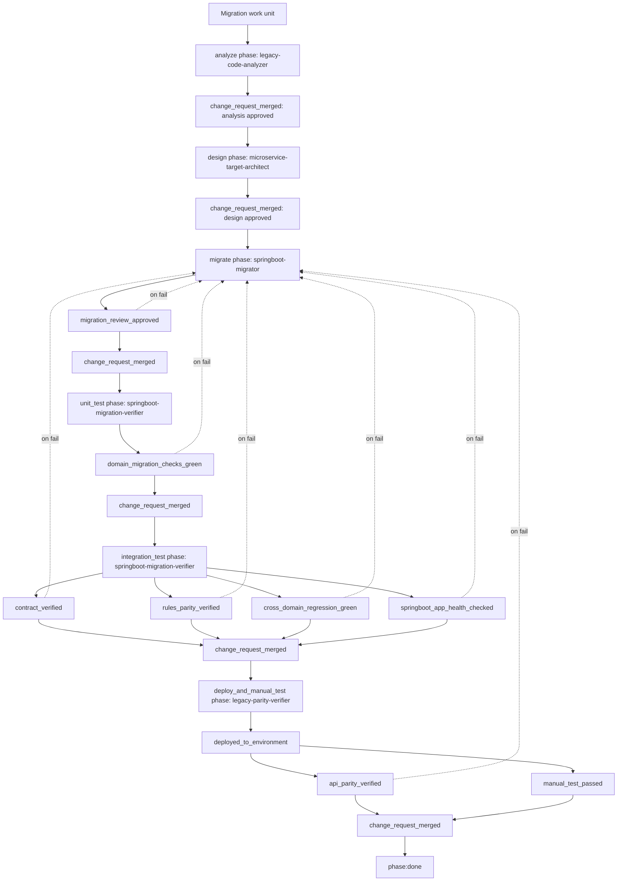

# Migration Workflow

The migration workflow is for legacy-to-target migrations, one work unit (domain, service, module,
or endpoint group) at a time. It is deliberately generic on the legacy side — the `legacy-code-analysis`
skill's technique is stack-agnostic and applies to any layered legacy integration/orchestration
system (visual flow tools, BPMN engines, scripted orchestration, or plain service code). The target
side is Spring Boot with an optional rule engine. Project-specific paths, contracts, verification
commands, and vocabulary live in `.agents/rules/migration-conventions.md`.

Process file: `.agents/process/migration.yaml`

## Workflow Diagram

## Roles And Models

| Order | Step | Phase or gate | Role | Codex model | Claude model | Skills |
|---:|---|---|---|---|---|---|
| 1 | Analyze legacy code | `analyze` phase | `legacy-code-analyzer` | `gpt-5-codex`, high | `opus` | `legacy-code-analysis` |
| 2 | Approve analysis | `change_request_merged` | Human | n/a | n/a | n/a |
| 3 | Microservice target design | `design` phase | `microservice-target-architect` | `gpt-5-codex`, high | `opus` | `migration-design`, `java-springboot`, `junit-parity-testing` |
| 4 | Approve design | `change_request_merged` | Human | n/a | n/a | n/a |
| 5 | Migrate slice | `migrate` phase | `springboot-migrator` | `gpt-5-codex`, high | `opus` | `java-springboot`, `junit-parity-testing` |
| 6 | Review migrated code | `migration_review_approved` | `springboot-migration-reviewer` | `gpt-5-codex`, high | `sonnet` | `java-springboot`, `junit-parity-testing` |
| 7 | Approve migrate | `change_request_merged` | Human | n/a | n/a | n/a |
| 8 | Unit test | `unit_test` phase, `domain_migration_checks_green` | `springboot-migration-verifier` | `gpt-5-codex`, low | `haiku` | n/a |
| 9 | Approve unit test | `change_request_merged` | Human | n/a | n/a | n/a |
| 10 | Integration test | `integration_test` phase, `contract_verified`, `rules_parity_verified`, `cross_domain_regression_green`, `springboot_app_health_checked` | `springboot-migration-verifier`, `api-contract-verifier`, `legacy-parity-verifier` | `gpt-5-codex`, low-medium | `haiku`/`sonnet` | `junit-parity-testing` |
| 11 | Approve integration test | `change_request_merged` | Human | n/a | n/a | n/a |
| 12 | Deploy to remote environment | `deploy_and_manual_test` phase, `deployed_to_environment` | Human/deploy owner | n/a | n/a | n/a |
| 13 | Verify API parity | `api_parity_verified` | `legacy-parity-verifier` | `gpt-5-codex`, medium | `sonnet` | `junit-parity-testing` |
| 14 | Manual test | `manual_test_passed` | Human tester | n/a | n/a | n/a |
| 15 | Merge final change | `change_request_merged` | Human | n/a | n/a | n/a |

## Phase Details

### Analyze

The `legacy-code-analyzer` extracts existing legacy behavior faithfully enough that design and
implementation can reproduce it: call-graph and domain-boundary discovery, signature and pipeline
lineage, field renames, branch logic, dependency behavior, functional config, side effects, error
codes, and a complete rule-corpus inventory with generated parity fixtures. It writes the
characterization report and golden fixtures; it does not design or implement.

The phase exits only after `change_request_merged`. Design must not start on an unapproved or
incomplete analysis.

### Design

The `microservice-target-architect` converts the approved analysis into a concrete Spring
Boot microservice target design: locked module structure, C4 architecture views, contract-exact
endpoints, DTO/DAL/rule/error mappings, deployment impact, and coding-agent-ready work packages. It
does not implement code and must not design across unresolved analysis gaps.

### Migrate

The `springboot-migrator` implements the approved work packages end to end — controllers, DTOs,
service orchestration, DAL clients, rule wiring — with unit, contract, rules parity, and API parity
tests written in the same pass. It keeps a progress artifact and implementation verification report
current for resume and handoff. The phase exits once `migration_review_approved` passes and the
change is merged; formal verification of those tests runs in the following phases.

### Unit Test

The `springboot-migration-verifier` runs domain-scoped build/unit/controller/service/client checks
against the merged migrate-phase code. On failure, work routes back to `springboot-migrator`.

### Integration Test

The `springboot-migration-verifier`, `api-contract-verifier`, and `legacy-parity-verifier` jointly
prove the migrated slice matches its target contract, offline rules parity, cross-domain regression,
and local runtime health. On failure, work routes back to `springboot-migrator`.

### Deploy And Manual Test

The migration branch is deployed to the project-defined remote environment, `legacy-parity-verifier`
proves remote API parity against captured legacy behavior, and a human tester manually exercises the
deployed slice. On failure, work routes back to `springboot-migrator`.

## Gate Details

| Gate | Owner | Purpose | Failure route |
|---|---|---|---|
| `migration_review_approved` | `springboot-migration-reviewer` | Migration code review verdict is approve, with no critical or blocking findings. | `springboot-migrator` |
| `domain_migration_checks_green` | `springboot-migration-verifier` | Domain-scoped build/unit/controller/service/client checks pass. | `springboot-migrator` |
| `contract_verified` | `api-contract-verifier` | Implemented API shape matches the target contract exactly. | `springboot-migrator` |
| `rules_parity_verified` | `legacy-parity-verifier` | Offline rules parity matches authoritative legacy fixtures. | `springboot-migrator` |
| `cross_domain_regression_green` | `springboot-migration-verifier` | Full regression introduces no new failures outside approved baseline waivers. | `springboot-migrator` |
| `springboot_app_health_checked` | `springboot-migration-verifier` | Local runtime starts and answers its health endpoint. | `springboot-migrator` |
| `deployed_to_environment` | Human/deploy owner | Migration branch is deployed and ready for remote parity. | Manual |
| `api_parity_verified` | `legacy-parity-verifier` | Deployed behavior matches captured legacy behavior (requires `deployed_to_environment`). | `springboot-migrator` |
| `manual_test_passed` | Human tester | A human tester exercised the deployed migration and confirms it behaves as expected (requires `deployed_to_environment`). | Manual |
| `change_request_merged` | Human/provider | Confirm approved merge at every phase boundary. | Manual |

## Required Convention Detail

At minimum, migration work needs `.agents/rules/migration-conventions.md` to be concrete about:

- migration unit vocabulary, legacy source root, and target source root
- target API/interface contract and architecture/characterization/progress artifact paths
- rule source paths, fixture path pattern, and fixture generator, or `none`
- data access boundary and local runtime/health endpoint
- remote parity base URL env var and deployment environment
- verification command source for each migration gate

## Design Rationale

The workflow mirrors the feature workflow's separation of requirements, design, and implementation,
but adds parity as a first-class concern: analysis exists specifically to produce evidence
(fixtures, signatures, error inventories) that later gates can check the target against. Splitting
unit test, integration test, and deploy-and-manual-test into their own phases — each with its own
change request and human approval — keeps every verification boundary an explicit, resumable
checkpoint instead of one large bundled gate list on `migrate`: a green build does not prove contract
conformance, and passing tests locally does not prove deployed behavior matches legacy.

## Done Criteria

A migration work unit is done when the deploy-and-manual-test-phase change request is merged after
`migration_review_approved`, `domain_migration_checks_green`, `contract_verified`,
`rules_parity_verified`, `cross_domain_regression_green`, `springboot_app_health_checked`,
`deployed_to_environment`, `api_parity_verified`, and `manual_test_passed` all pass, with a
`change_request_merged` approval at every phase boundary along the way.
